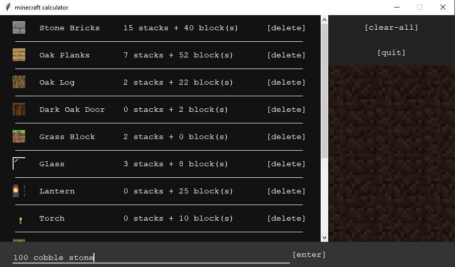
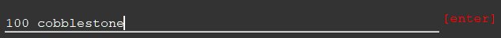
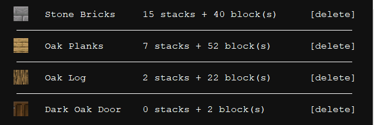
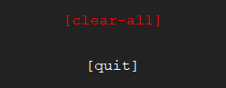

# Minecraft block calculator

This is a Python GUI application for making a list of building blocks for a project



## Installation

- ```bash
    $git clone https://github.com/5lic/minecraft-block-calculator
    ```

- download *.zip* and extract it.

## Usage

### Adding a New Block



**entry format:** `[number] [name of block]`

*note: to view the icon of the block, the currect name of the block to be entered.*

- (`oak logs` ❌ | `oak log` ✔️  )
- (`cobble stone` ❌ | `cobblestone` ✔️ )

### Viewing and Deleting



- scroll to view all blocks.
- click on delete to remove block from list.

### Clear All



- clear the entire list.

## Contributing

Pull requests are welcome. For major changes, please open an issue first to discuss what you would like to change.

## License

[MIT](./license.md)
